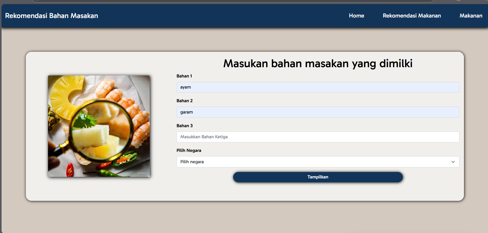
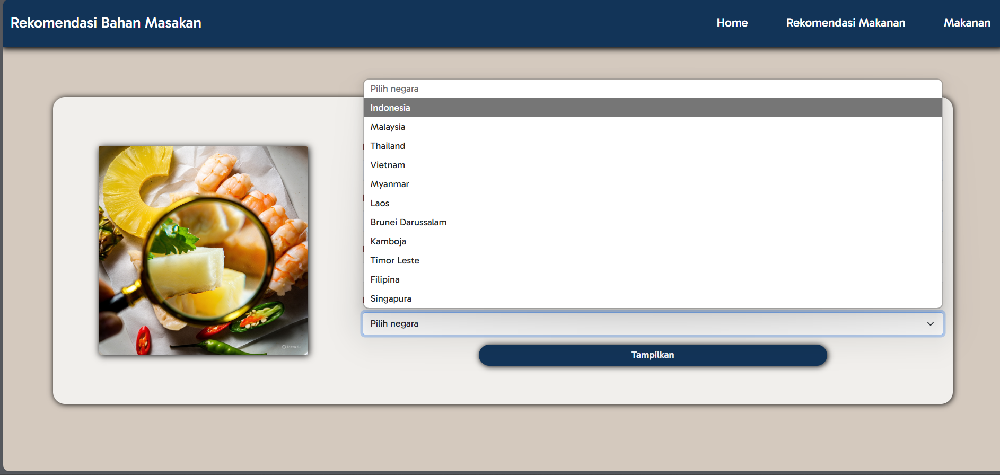
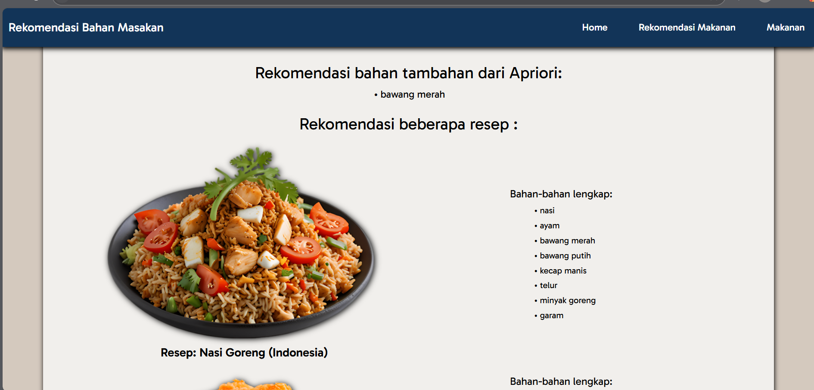

# Southeast Asian cooking ingredient recommendation system apriori

This application recommends additives and recipes based on the ingredients that users have as well as the country of origin of the recipe. The system uses the Apriori algorithm to find combinations of ingredients that are commonly used together.

## How to Run

1. Clone the repository:
   ```bash
   git clone https://github.com/bebekgarut/association-rules-apriori-southeast-asian-food.git
   ```
2. Navigate to the project directory:
   ```bash
   cd association-rules-apriori-southeast-asian-food
   ```
3. Install Flask:
   ```bash
   pip install flask
   ```
4. Run app.py:
   ```bash
   python app.py
   ```

## Example Usage

1. Add cooking ingredients such as `ayam` and `garam`.
   

2. Select a country, for example `Indonesia`
   
   

3. Click 'Tampilkan' to see additional ingredient recommendations and related recipes.
   
   
